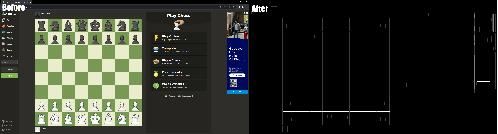
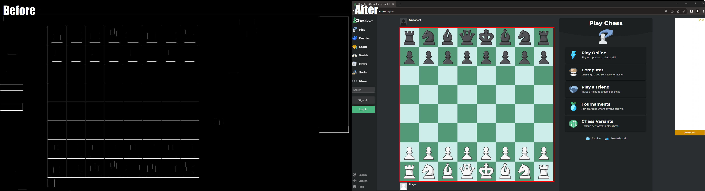

<h1 align="center">Chess Bot</h1>

<i>A chess bot that plays chess for you</i>

This repository is a personal project of a chess bot that is meant to play chess for you on any chess site: Chess.com, Lichess.com, Chess24.com, etc.

<h2>Breakdown:</h2>

  <h4>1) Board Detection</h4>
  Board detection is achieved through the use of image manipulation with <a href="https://opencv.org/">OpenCV.</a> Using <code>cv2.Canny()</code> filters the edges of the image - 
  allowing for later use of <code>cv2.getStructuringElement()</code> and <code>cv2.erode()</code> to extract horizontal/vertical lines only. The next step is to combine the two filtered images into one with <code>cv2.maximum(img1, img2)</code>. 
  The resultant image now contains only straight and horizontal lines, allowing for contour detection around the vertices of the squares within the image.   
  

  For all single-channel arrays of the image, <code>cv2.findContours()</code> is used to find all possible vertices of various squares within the image. Then, they are filtered through to ensure only the vertices of the 64 squares that make up the chess board are used. These vertices are then used to determine the coordinates of the chessboard within the image.  

<h4>2) Piece Recognition</h4>
<h4>3) Next Chess Move</h4>
